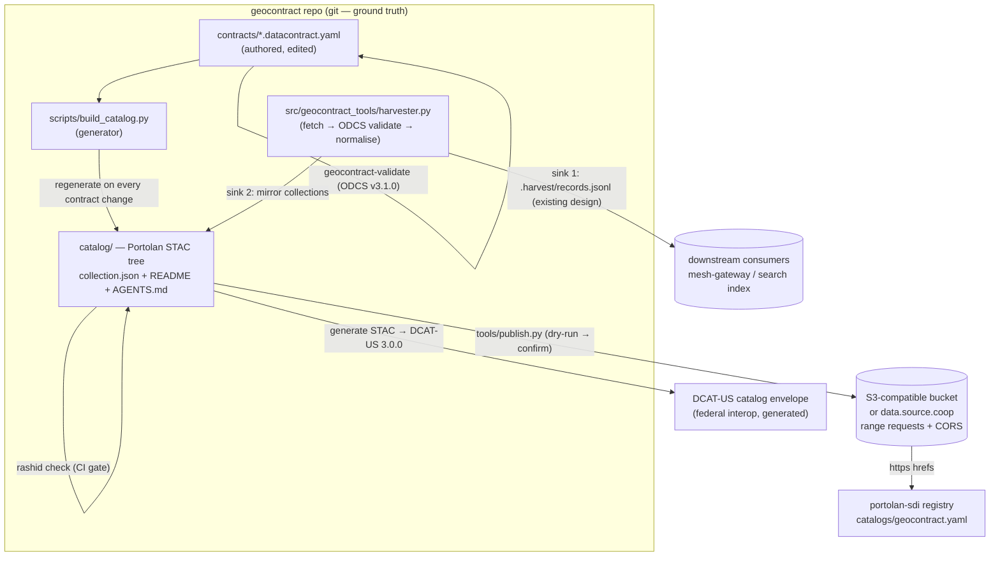

# Implementation Plan — Portolan as the Catalog Basis for geocontract

> Status: Phase 0 complete; probes resolved the open questions in §6
> Spec baseline: `portolan-spec` @ v0.2.0 (submodule, pinned)
> Skills baseline: `portolan-skills` @ `pins.toml` (portolan-cli 0.8.0, rashid 0.1.8)
> Upstream: https://github.com/portolan-sdi/portolan
>
> Probe evidence and the decisions it settled live in
> [`portolan-conformance-notes.md`](./portolan-conformance-notes.md).
> Where this plan and that file disagree, that file wins: it records what the
> released validator actually did.

---

## §0 Summary

geocontract today produces **ODCS v3.1.0 data contracts** that can live
anywhere, plus a **hand-curated DCAT-US 3.0.0 catalog envelope** and a
**designed-but-stubbed federated harvester**. Portolan is a pre-1.0
spec for **git-backed, cloud-native geospatial catalogs**: a plain
directory tree of STAC 1.1.0 JSON (`catalog.json` / `collection.json`)
with `README.md` + `AGENTS.md` at every level, open-format data assets
(GeoParquet / Parquet / COG / PMTiles) on S3-compatible storage, and
conformance proven by the `rashid` validator.

This plan makes the Portolan conventions the **structural basis of the
geocontract catalog**: every published geocontract becomes a Portolan
collection; editing happens through the git-backed-catalog loop
(edit contract → generate metadata → validate with ODCS **and** rashid →
conventional commit → publish); and harvesting others is expressed with
Portolan's mirror semantics (`providers` producer ≠ host, `via` /
`canonical` links, `updated` = sync time, `source`-role asset), which
the federated harvester emits as a new sink alongside its JSONL output.

The DCAT-US layer is retained but becomes a **generated projection** of
the Portolan tree instead of the curated source of catalog truth.

---

## §1 Goal and non-goals

### Goal

1. **Edit** — a single git loop for authoring contracts and keeping the
   catalog metadata in sync, with CI gates on both sides.
2. **Catalog** — a Portolan-conformant catalog whose collections are the
   published geocontracts, validated by `rashid` and publishable to
   S3-compatible hosting (including Source Cooperative).
3. **Harvest others** — extend the federated harvester so each harvested
   source produces (a) the already-designed JSONL records and (b) a
   Portolan **mirror collection** under `catalog/mirror/`.

### Non-goals

- No new server or database. Portolan is files + HTTP; we keep that.
- No change to the ODCS v3.1.0 contract format itself. Contracts stay
  the authored source of truth; catalog JSON is generated.
- No on-chain / anchor-service work (per plan v2 §13, separate repos).
- No harvesting of restricted (PII) projections into any published
  catalog — hard gate, see §10.

---

## §2 What we adopt from the submodules

### From `portolan-spec` (v0.2.0)

| Adopted | Where it comes from |
| --- | --- |
| STAC 1.1.0 tree: `catalog.json` + `README.md` + `AGENTS.md` at **every** catalog and collection level (PORTO-CORE-005) | `specs/portolan/core.md` |
| Portolan profile URI in `stac_extensions` as the single version signal | `stac/json-schema/v0.2.0/schema.json` |
| Asset discipline: `href` / `type` / `roles` required, absolute `https://` hrefs, `file:size` + `file:checksum` SHOULD | core.md, formats.md |
| **Parquet is allowed for non-spatial data**; tabular collections declare `extent` as *area of interest*, not footprint | `formats.md` §Tabular, `core.md` §Bounding Boxes |
| Mirror semantics: producer ≠ host, `via` link, `canonical` when upstream has STAC, `updated` = last sync, `source`-role asset for the original | core.md, reference catalog `ar/mirror/` |
| Conformance = passing `rashid` (three passes: structural, metadata, data) | `specs/portolan/requirements.yaml` (128 IDs) |
| Hosting: range requests, accurate `Content-Length`, permissive CORS | core.md §Data Storage |

### From `portolan-skills` (pinned via `pins.toml`)

| Skill | Used for |
| --- | --- |
| `git-backed-catalog` (Mode B) | The edit → validate → commit → publish loop (§12) |
| `portolan-cli` | Command reference: `init`, `add`, `check`, `push`, `extract`, `metadata`, `readme` |
| `portolan-bootstrap` | First-time "portolan-ify" of each contract; upstream probing (`scripts/probe-upstream.sh`) |
| `portolan-migrate` | Playbook when the pinned spec version bumps (audit → repair → negative control → republish) |
| `sourcecoop` | Optional hosting target on `data.source.coop` |
| `register-catalog` | Final PR into the portolan-sdi registry (`catalogs/$SLUG.yaml`, two fields) |
| `report-catalog-issue` | Interop with other catalogs' feedback loop |
| `reading-portolan` | Consumer docs we point users at |

The repo already vendors both submodules; **Phase 0 wires them into a
root `AGENTS.md`** so coding agents in this repo automatically follow
the same conventions.

---

## §3 Concept mapping: ODCS contract → Portolan collection

Each `contracts/*.datacontract.yaml` maps to one collection under a
thematic sub-catalog. The contract YAML remains the authored artifact;
`collection.json` is **generated** (edit generators, not output — the
skill's rule).

| ODCS v3.1.0 field | Portolan / STAC target | Notes |
| --- | --- | --- |
| `id: geocontract-nepa-exclusions` | collection `id` slug `nepa-exclusions` | lowercase letters / numbers / hyphens |
| `name` | `title` | human-readable, no slugs (warning heuristic) |
| `description.purpose / usage / limitations` | `description` + the three same sections in `README.md` | README is required anyway |
| `version`, `status` | custom `geocontract:version` / `geocontract:status` properties | **Resolved by probe:** the profile schema tolerates prefixed custom properties (notes §F2) |
| `tenant` (e.g. us-federal-permitting-innovation-center) | `providers[]` `producer` | |
| — (catalog operator) | `providers[]` `host`, listed **last**, with `url`/`email` | required exactly once |
| `license` | `license` (SPDX) | **Resolved: lives in the catalog manifest.** ODCS sets `additionalProperties: false` and has no `license` field (notes §F7) |
| `servers[].location` | `source`-role asset, or `rel: canonical` when upstream publishes STAC | Raw endpoint. **Not** the `via` link — see the next row |
| — (human landing page) | `via` link, `type: text/html` | **Resolved by probe:** `via` must be `text/html`, so a raw JSON endpoint errors (notes §F4). The manifest states the landing page per collection |
| `schema[]` entities | `table:columns` / `table:primary_geometry` / `table:row_count` via `odcs_flatten.py` | **Required for non-spatial collections:** without `table:columns` the validator cannot tell a table from a spatial layer and asks for a thumbnail (notes §F5) |
| `tags` | `keywords` | |
| the contract file itself | **asset, role `metadata`, type `application/yaml`** | **Resolved by probe:** a metadata-only collection passes with zero findings (notes §F1). No `data`-role asset is required |
| the data behind the contract (e.g. `external/exclusions.json`) | **asset, role `data`**, as Parquet (non-spatial) or GeoParquet | converted + spatially sorted via `gpio`; stored in the bucket, never in git |
| — | `extent.spatial.bbox` | area of interest (e.g. CONUS / global) for non-spatial collections per core.md |
| — | `stac_extensions` includes `https://schemas.portolan-sdi.org/portolan/v0.2.0/schema.json` | the version pin |

Initial tree (collections are leaves; sub-catalogs nest freely):

```
catalog/
├── catalog.json               # root; also README.md + AGENTS.md
├── federal/
│   ├── catalog.json           # sub-catalog (mirrored federal sources)
│   └── nepa-exclusions/       # collection.json, README.md, AGENTS.md
├── standards/
│   └── pic-standards/         # 13-entity PIC NEPA Data Standard
├── citizen/
│   └── groton-rhine-001/      # worked citizen Proposal (public projection)
└── mirror/                    # harvested third-party contracts (§9)
    └── <harvested-slug>/
```

---

## §4 Target architecture



Key invariants:

1. **One source of truth per fact.** Contracts carry semantics; catalog
   JSON is derived; DCAT-US is derived from the catalog.
2. **Data never enters git.** The 4 MB `external/exclusions.json`
   snapshot stays a vendored dev fixture; the published `data`-role
   Parquet/GeoParquet asset lives only in the bucket.
3. **Relative hrefs in the tracked tree, absolute in the published
   root** (the published root gains the absolute `self` link,
   PORTO-CORE-081); `CI_LIGHT=1` in CI exempts asset bytes.

---

## §5 Repository layout decision

**Decision: keep the catalog as a `catalog/` subtree of this repo
(Phase 1), with an explicit option to split it into a dedicated
`geocontract-catalog` repo before registry submission.**

Rationale: the edit loop (§12) is cross-artifact by nature — a contract
edit and its regenerated `collection.json` belong in one commit and one
PR. The portolan-catalog-template's `tests/`, `tools/publish.py` and CI
workflow get ported into this repo's `mise.toml` / `.github/` rather
than imported wholesale. If the catalog later needs independent
contributions from third parties, the `portolan-migrate` +
`git-backed-catalog` Mode C skills cover moving it out.

---

## §6 Phase 0 — Pinning and conformance probes (no product code)

**Status: complete.** Seven probe collections were built and validated with
`rashid` 0.1.8, including two negative controls. Evidence and reasoning are in
[`portolan-conformance-notes.md`](./portolan-conformance-notes.md).

| ID | Item | Outcome |
| --- | --- | --- |
| P0-1 | Does a metadata-only collection pass `rashid`? | **Yes.** `probe-d-official` carried one `metadata`-role YAML asset and no `data`-role asset, and produced zero findings. No Parquet conversion is required before publishing (notes §F1). |
| P0-2 | Are custom prefixed properties tolerated? | **Yes.** `probe-b-custom-props` was byte-identical in findings to `probe-a-meta-only` with `geocontract:version`, `geocontract:status`, and `geocontract:lifecycle_state` added (notes §F2). |
| P0-3 | Where does the license live? | **In the catalog manifest.** ODCS sets `additionalProperties: false` and has no `license` field, so a license key in a contract YAML fails `mise run validate-odcs`. The SPDX value per collection is still a human decision (notes §F7, open item 1). |
| P0-4 | Toolchain pins | **Done.** `RASHID_SPEC`, `PORTOLAN_CLI_SPEC`, and `PORTOLAN_SCHEMA_URI` live in `mise.toml` `[env]` as one canonical home. `mise run portolan-pins` resolves both: `portolan, version 0.8.0`. |
| P0-5 | Root `AGENTS.md` | **Done.** Synced norms block verbatim, plus a repo-specific section that overrides it where geocontract differs (CC0-1.0, not Apache-2.0; not a portolan-sdi repo). `CLAUDE.md` carries the one-line `@AGENTS.md` import. |
| — | Conformance register | **Done.** `docs/portolan-conformance.md` holds the ACCEPTED allow-list, currently empty, plus the expected informational ceiling. |

### Two findings that changed the design

**F3 — `rashid` derives mirror status from `providers`.** When producer and
host are different organisations, the collection is a mirror and a missing
`rel: via` is an **error** (`PTL-PRO-001`). When one provider entry holds
`producer`, `licensor`, and `host` together, the collection is official. The
negative control `probe-f-mirror-no-via` confirms the rule fires.

Consequence: `federal/nepa-exclusions` is a **mirror**, because geocontract
republishes data the Permitting Innovation Center produced. `standards/` and
`citizen/` are **official**, because geocontract originates them. Naming an
upstream producer as host would be false.

**F4 — the `via` link must be `text/html`.** A `via` link pointing at the raw
JSON endpoint with `type: application/json` errors. So
`servers[].location` cannot feed `via` directly; the manifest states a
human landing page per mirrored collection, and the raw endpoint becomes a
`source`-role asset instead.

### Verification

```bash
mise run portolan-pins        # both pins resolve; prints portolan 0.8.0
mise run portolan-calibrate   # 0 errors, 0 warnings, 16 info across 28 files
```

`portolan-calibrate` passes `--no-data` on purpose. The data pass reads asset
bytes and fetches remote hrefs, which makes the run slow and network-dependent
without answering the calibration question. Both variants report the same 16
info findings; the offline variant runs in under one second.

---

## §7 Phase 1 — Catalog scaffold and generator (PR: "feat: catalog")

Deliverables:

1. `scripts/build_catalog.py` — reads `contracts/*.datacontract.yaml`,
   emits per-collection `collection.json` + per-sub-catalog `catalog.json`
   into `catalog/`, following the §3 mapping. Idempotent; fails if a
   contract lacks license / producer (the two Portolan hard
   requirements we can't infer).
2. Hand-authored `README.md` + `AGENTS.md` at root, each sub-catalog,
   and each collection (these are curated, not generated — but their
   purpose/usage/limitations sections can be *seeded* from the contract
   `description` on first generation).
3. `mise` tasks: `catalog-build`, `catalog-check` (= build + `rashid
   check catalog/ --summary`).
4. First three collections: `federal/nepa-exclusions`,
   `standards/pic-standards`, `citizen/groton-rhine-001` — metadata
   only. P0-1 proved this shape passes clean, so no Parquet conversion
   blocks publication. Data assets arrive in Phase 2/§9 harvesting or a
   later conversion task.

Verification: `rashid check catalog/ --summary` passes locally with
`CI_LIGHT` unset; `geocontract-validate` still passes on all contracts;
existing pytest suite green.

---

## §8 Phase 2 — Publishing and CI gates (PR: "feat: publish + ci")

1. Port the template's publish path: `tools/publish.py` (metadata) and
   `tools/upload_data.py` (assets) with dry-run → `--confirm` →
   `--force` semantics; publishing never deletes — stale objects are
   pruned explicitly, guarding incomplete local trees.
2. Hosting decision (P2-1): S3-compatible bucket vs
   `data.source.coop` via the `sourcecoop` skill. Either way the
   endpoint must pass the spec's range-request / `Content-Length` /
   CORS probes (`portolan-bootstrap/scripts/probe-upstream.sh`).
3. GitHub Actions: on PR — `geocontract-validate`, `pytest`,
   `catalog-build`, `rashid check` with `CI_LIGHT=1`; on main —
   publish dry-run. `ACCEPTED` allow-list discipline imported from the
   skill (row in `docs/portolan-conformance.md` + tracking issue, or nothing).
4. Conversion task (optional here, required before registry): turn
   `external/exclusions.json` into a sorted Parquet asset via `gpio`
   (non-spatial → Parquet per formats.md) and register it as the
   `data`-role asset of `federal/nepa-exclusions`.

Verification: a fresh clone passes CI with no data bytes; a published
URL passes `rashid check --live --live-base-url <url>`.

---

## §9 Phase 3 — Harvesting others (mirror pipeline)

The harvester design (`docs/design-harvester.md`) already specifies
fetch (local / git / HTTPS / S3), ODCS validation, and normalisation.
Portolan adds a second sink and reuses its mirror semantics.

1. Implement the fetch layer in `harvester.py` per the design doc
   (explicit list → `--index` manifest → DNS discovery later).
2. Sink interface: `--sink jsonl` (existing `.harvest/` layout) and
   `--sink portolan`. The Portolan sink writes/updates
   `catalog/mirror/<slug>/collection.json` with:
   - `providers`: producer = upstream agency (from the harvested
     contract's `tenant`), host = us → mirror is derivable;
   - `via` link to the upstream contract / dataset page;
   - `canonical` link when the upstream publishes STAC;
   - `updated` = fetch time (RFC 3339);
   - `source`-role asset pointing at the original with real
     `file:size` + multihash checksum from `.harvest/manifest.json`.
3. Conflict resolution (design-doc open question 1): **fail the harvest
     on overlapping contract ids** unless the pair is explicitly
     allow-listed in the index manifest with a priority order. Keeps
     the catalog deterministic.
4. Version handling (open question 2): refuse unknown `apiVersion`
     major bumps; best-effort forward-compat within v3.x, matching the
     pinned ODCS schema.
5. Non-ODCS geo sources (ArcGIS / WFS / Carto): `portolan extract` →
   `gpio` → GeoParquet `data` assets; the contract for such a source
   is authored by us, so it lands in the appropriate sub-catalog
   (not `mirror/`) with the upstream cited via `via`.

Verification: harvesting two real sources produces both JSONL and
conformant mirror collections; re-running is a no-op diff except
`updated`; a planted duplicate id fails the run.

---

## §10 Phase 4 — Citizen proposals in the catalog

- `geocontract-harvest-citizen-dir` output (`manifest.json`,
  `records.jsonl`) gains the same `--sink portolan`: each public
  projection becomes `catalog/citizen/<id>/` carrying
  `content_hash`, `lifecycle_state`, `supersedes` (as `geocontract:*`
  custom properties — P0-2 proved the schema tolerates them), and the
  **ODCS-flatten YAML** as the `metadata`-role asset.
- **Hard gate:** the restricted projection (§5.8 of plan v2) never
  enters the catalog tree or the bucket. Enforced in
  `public_projection.py` terms: the Portolan sink only ever consumes
  the public projection — no `--authority-token` path exists in the
  sink, by construction.
- Lifecycle transitions (`draft → submitted → … → superseded`) map to
  regeneration of the same collection with `updated` + a
  `geocontract:supersedes` pointer; we never keep two live collections
  for the same proposal id.

---

## §11 Phase 5 — Registry, DCAT-US regeneration, drift control

1. **Registry submission** via the `register-catalog` skill: PR to the
   portolan-sdi registry adding `catalogs/geocontract.yaml`
   (`url` + `submitter_email` only), gated on
   `rashid check --live` passing against the published URL.
2. **DCAT-US becomes generated**: replace the curated
   `examples/dcat-us-catalog.example.data.json` workflow with a
   generator that walks the published Portolan tree
   (collection → DCAT dataset: title, description, license, keywords,
   distribution links to assets). Federal consumers keep their
   vocabulary; the catalog stops being maintained twice.
3. **Drift control**: mirror `portolan-skills/pins.toml` versions into
   `mise.toml` + CI check; submodule bump policy — a `portolan-spec`
   MINOR bump (breaking, pre-1.0) triggers the `portolan-migrate`
   skill playbook: audit defects, repair generator + curated files,
   add a negative control (plant a violation, confirm rashid fires),
   republish, prune orphans.

---

## §12 The editing loop (operator's view)

```bash
# 1. edit the contract (the authored artifact)
$EDITOR contracts/nepa-exclusions.datacontract.yaml

# 2. ODCS gate
uv run geocontract-validate contracts/nepa-exclusions.datacontract.yaml

# 3. regenerate catalog metadata (edit generators, not output)
mise run catalog-build

# 4. Portolan gate (both validators must pass)
mise run catalog-check        # runs rashid check catalog/ --summary

# 5. commit (conventional) — contract + regenerated JSON in one commit
git commit -m "feat: add extraordinary-circumstances field to nepa-exclusions"

# 6. publish (Phase 2+)
python3 tools/publish.py          # dry run
python3 tools/publish.py --confirm
```

PR bodies carry `## What changed / ## Why / ## Verification` with real
command output pasted; no-behavior-change PRs tick the waiver instead.

---

## §13 Open questions and risks

Rows 1 to 3 are settled by the Phase 0 probes. Evidence is in
[`portolan-conformance-notes.md`](./portolan-conformance-notes.md).

| # | Question / risk | Status / resolution |
| --- | --- | --- |
| 1 | Metadata-only collections vs `data`-role requirement | **Settled (F1).** Legal; zero findings. No fallback needed. |
| 2 | Custom `geocontract:*` property tolerance | **Settled (F2).** Tolerated by the profile schema. |
| 3 | Where licenses live | **Settled (F7).** Catalog manifest, because ODCS forbids unknown keys. The SPDX value per collection still needs a human decision (notes open item 1). |
| 4 | Mirror vs official per collection | **Settled (F3, F4).** Derived from `providers`; `via` must be `text/html` and comes from the manifest. |
| 5 | Extent for non-spatial collections | Area-of-interest bbox per collection in the manifest. `table:columns` settles geospatiality (F5). Never sentinel or global values (core.md bbox rules). |
| 6 | Catalog home: subtree now vs dedicated repo later | §5 decision; revisit before registry submission. |
| 7 | Pre-1.0 spec churn (breaking MINOR bumps) | Pin submodules; migrate via the `portolan-migrate` playbook. |
| 8 | `portolan check` vs bare `rashid check` version skew | Both pinned in `mise.toml` `[env]`; CI uses the pinned rashid directly. |
| 9 | Harvester conflict resolution | §9.3: fail-on-overlap + manifest allow-list. |

---

## §14 Skill ↔ phase cross-reference

| Phase | Primary skill | Secondary |
| --- | --- | --- |
| 0 | `portolan-cli` (install, `config list`) | `reading-portolan` |
| 1 | `portolan-bootstrap` (QC + provenance discipline) | `portolan-cli` (`init`, `metadata`, `readme`) |
| 2 | `git-backed-catalog` (Mode B publish loop) | `sourcecoop`, `portolan-thumbnails` (only where geometry exists) |
| 3 | `portolan-bootstrap` (mirror-path assessment, upstream probing) | `portolan-cli` (`add-external`, `extract`) |
| 4 | `reading-portolan` (what consumers will do with proposals) | — |
| 5 | `register-catalog`, `portolan-migrate` | `report-catalog-issue` (inbound feedback) |
