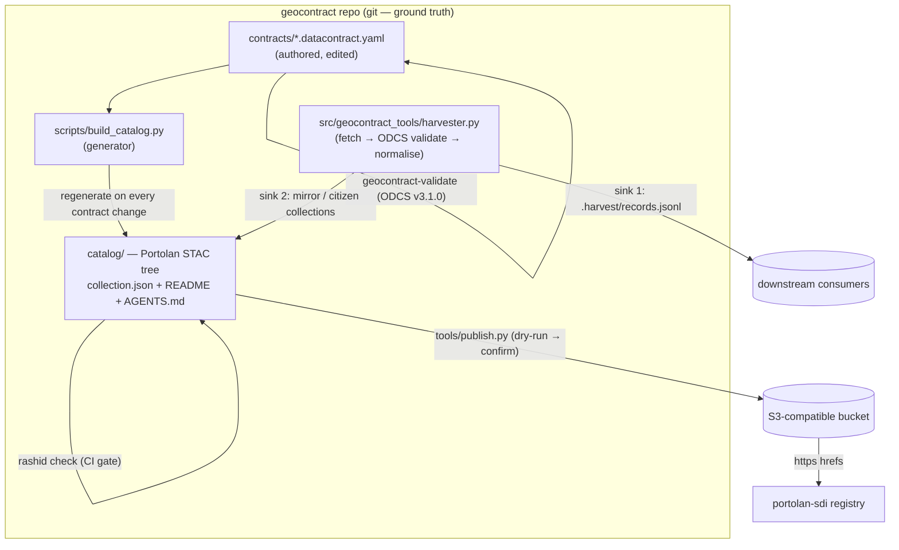

# Portolan Catalog Integration Guide

> Spec baseline: `portolan-spec` @ v0.2.0
> Tools: `portolan` 0.8.0, `rashid` 0.1.8
> Status: Phases 0–4 complete; Phase 5 in progress

This guide explains how to consume, publish, and contribute to the geocontract
Portolan catalog. Read it alongside the plan at
`docs/plan-portolan-catalog-integration.md`, which records the design decisions
and the conformance evidence behind them.

---

## Catalog structure

```
catalog/
├── catalog.json           # root catalog (README.md + AGENTS.md at every level)
├── federal/
│   ├── catalog.json       # mirrored federal collections
│   └── nepa-exclusions/   # collection.json, README.md, AGENTS.md
├── standards/
│   └── pic-standards/     # 13-entity PIC NEPA Data Standard
├── citizen/
│   └── groton-rhine-001/  # citizen proposal — public projection only
└── mirror/
    └── <harvested-slug>/  # third-party contracts harvested via portolan sink
```

There are three collection types:

| Type | Path prefix | Authored or generated | `providers` shape |
| --- | --- | --- | --- |
| Federal (official) | `catalog/federal/` | Generated from `contracts/*.datacontract.yaml` | Single entry: producer + host + licensor |
| Mirror (harvested) | `catalog/mirror/` | Generated by harvester Portolan sink | Separate producer (upstream) and host (geocontract) |
| Citizen proposal | `catalog/citizen/` | Generated from citizen contracts | Single entry: official, public projection only |

---

## Consuming the catalog

### Search and retrieve with rashid

```bash
# List all collections
rashid list catalog/

# Inspect a specific collection
rashid show catalog/federal/nepa-exclusions/collection.json

# Validate the full catalog
mise run catalog-check
```

### Consume from the published URL

The catalog is published to the destination in `catalog.publish.yaml`. Once
published, consumers can address it by the public base URL. Use range requests;
the host must support accurate `Content-Length` and permissive CORS.

### Python API

```python
from geocontract_tools.harvester import Harvester

h = Harvester(source_dir="contracts/", catalog_dir="catalog/")
records = h.harvest()
```

---

## Publishing the catalog

The publish script validates the catalog before uploading. It never deletes
objects from the destination.

```bash
# Dry run: see what would be published
mise run publish

# Publish to the configured destination (needs credentials for S3)
mise run publish-confirm
```

Publishing rules:

- **Validate first.** `rashid check` runs before any upload. Fix errors first.
- **Never delete manually.** Remove objects separately when intended.
- **Change detection.** Files upload only when size or checksum differs. Use
  `--force` after changing `Content-Type`.
- **Relative links in git, absolute when published.** Structural links stay
  relative in the tracked tree. The published root gains an absolute `self`
  link (PORTO-CORE-081).
- **Data files do not belong in git.** Build them, upload with a data upload
  script, and reference them by public URL in the STAC.

Configure the destination in `catalog.publish.yaml`:

```yaml
destination: s3://your-bucket/catalog/
public_base: https://data.example.org/geocontract/
region: us-east-1
```

---

## Contributing contracts

### Federal contracts

1. Create a contract in `contracts/` following the ODCS v3.1.0 schema.
2. Run the ODCS gate: `uv run geocontract-validate contracts/<name>.datacontract.yaml`
3. Regenerate the catalog: `mise run catalog-build`
4. Run the Portolan gate: `mise run catalog-check`
5. Commit both the contract and the regenerated JSON in one conventional commit.
6. Open a PR with `## What changed`, `## Why`, and `## Verification` sections
   containing real command output.

### Citizen proposals

Citizen-initiated contracts carry `isCitizenInitiated: true` in their custom
properties. The harvester detects this flag and routes the collection to
`catalog/citizen/` instead of `catalog/mirror/`.

Two rules apply automatically:

- **Bbox coarsening.** The bounding box is rounded to 2 decimal places
  (≈ 1.1 km precision) to protect location privacy.
- **Public projection.** Only the public projection is ever written to the
  catalog. The restricted projection never enters the catalog tree or the
  bucket — there is no `--authority-token` path in the Portolan sink.

```bash
# Harvest with citizen proposal detection
uv run python -m geocontract_tools.harvester \
  --source contracts/ \
  --catalog-dir catalog/ \
  --portolan

# Verify coarsened bbox
cat catalog/citizen/groton-rhine-001/collection.json | jq '.extent.spatial.bbox'
```

### Mirroring external catalogs

Use the harvester with the Portolan sink to mirror a third-party contract:

```bash
mise run harvest-portolan
# or directly:
uv run python scripts/harvest.py contracts/example.datacontract.yaml --sink portolan
```

Mirror collections include:

- `providers`: upstream producer and geocontract as host (separate entries)
- `via` link to the upstream landing page (`text/html`)
- `updated` = harvest timestamp
- `source`-role asset with the original contract YAML and SHA-256 multihash
- `geocontract:mirror = true` custom property

---

## Validation gates

Two validators must pass before any PR merges:

| Gate | Command | What it checks |
| --- | --- | --- |
| ODCS | `uv run geocontract-validate contracts/<name>.yaml` | Contract schema, required fields |
| Portolan | `mise run catalog-check` | STAC structure, providers shape, asset roles, bbox rules |

The expected information ceiling is 3 `PTL-PRO-002` findings (canonical link
suggestions on mirror collections). Zero errors and zero warnings are required.
See `docs/portolan-conformance.md` for the ACCEPTED allow-list.

---

## Architecture



Key invariants:

1. **One source of truth per fact.** Contracts carry semantics; catalog JSON is
   derived; DCAT-US is derived from the catalog.
2. **Data never enters git.** Parquet and GeoParquet data assets live only in
   the bucket.
3. **Relative hrefs in git, absolute when published.**

---

## Phase-to-skill cross-reference

| Phase | Primary skill | Secondary |
| --- | --- | --- |
| 0 — Probes | `portolan-cli` | `reading-portolan` |
| 1 — Scaffold | `portolan-bootstrap` | `portolan-cli` |
| 2 — Publish + CI | `git-backed-catalog` (Mode B) | `sourcecoop` |
| 3 — Mirror harvest | `portolan-bootstrap` | `portolan-cli` |
| 4 — Citizen proposals | `reading-portolan` | — |
| 5 — Registry + docs | `register-catalog`, `portolan-migrate` | `report-catalog-issue` |

Skills live in the `portolan-skills/` submodule. Use them rather than
re-deriving their workflows. See `AGENTS.md` for the full skill map.
